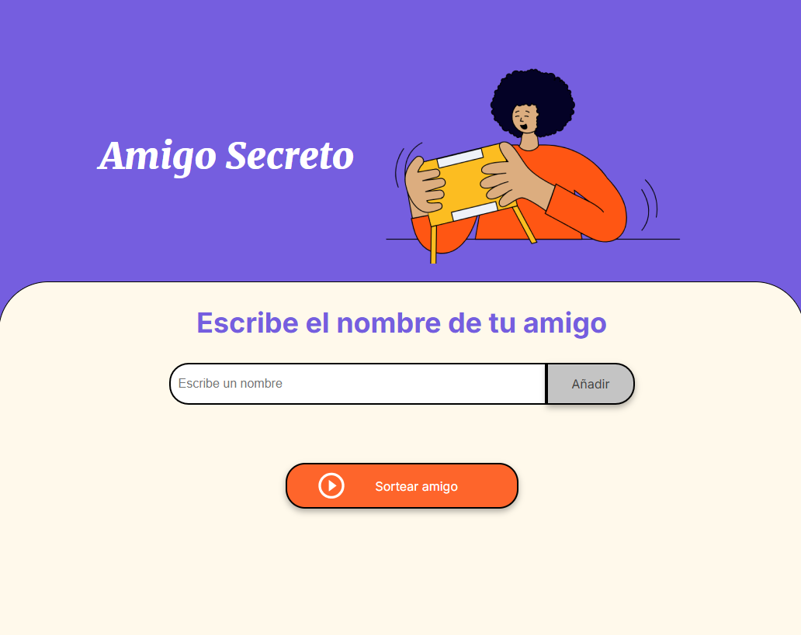
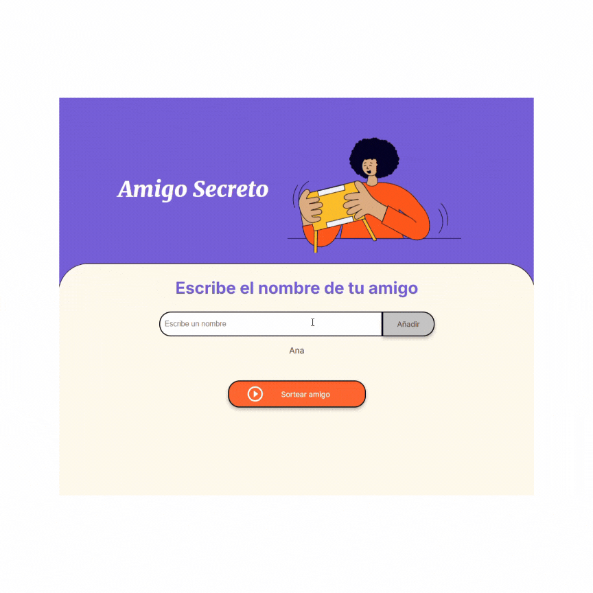

<h1 align="center"> AMIGO SECRETO </h1>

## Índice
---

* [AMIGO SECRETO](#Portada)
* [Descripción del Proyecto](#descripción-del-proyecto)
* [Como Funciona](#cómo-funciona)
* [Enlace al Proyecto](#enlace-al-proyecto)
* [Software Utilizado](#software-utilizado)
* [Personas Contribuyentes](#personas-contribuyentes)
* [Desarrolladores](#personas-desarrolladoras-del-proyecto)
* [Licencias](#licencia)

## Descripción del Proyecto
> Este proyecto es realizado como reto o "Challenge" para Alura-ONE, esta es mi humilde muestra de lo aprendido a lo largo del curso brindado con tanta calidad por la gente de Alura Latam y ONE Oracle, donde ellos enseñaron los pasos del desarrollo de este juego, utilizando pensamiento crítico, técnicas de programaión y desarrollo básico en JavaScript e introducción al DOM, para llegar a este momento y a partir de ahora a seguir aprendiendo y mejorando.
---
    Este proyecto está construcción constante y listo para mejoras y críticas constructivas :D
---

Cómo funciona?
---
    Te estarás preguntando que hace?? o cómo se utiliza este proyecto?

    En principio vas a necesitar un navegador como Chrome, Firefox, Edge o el que más te guste utilizar,

    Este proyecto es para jugar con amigos, es muy simple...
   * Escribes el nombre de tu amigo en el espacio que dice "Escribe un nombre"
    
   * Luego le das click en "Añadir" y vas creando una lista con tus amigos!!
    
   * Por último y cuando ya ingresaste a todos tus amigos presionas "Sortear amigo" 
   

     #### y ZAS!! Sale ganador un nombre al cual le vas a regalar un abrazo o un bonito presente de tu amistad ";)" 

Enlace al proyecto
---

[Amigo-Secreto](https://github.com/Irinath/challenge-amigo-secreto_esp-main.git)

---

Software utilizado
---

    HTML5, CSS3, JavaScript, VisualStudio Code, Chrome, cerebro, amor y paciencia.
---

Personas Contribuyentes
---

Quiero dar las gracias a mi hijo <strong>Marcos</strong> que banca mis locuras y a
  
 

---

Personas Desarrolladoras del Proyecto
---
   
    Valeria Irina Thomas (irinath)
---

#### Licencia.
    Tipo de Licencia libre MIT
<a href="./Licencia.md">Licencia MIT</a>,
    